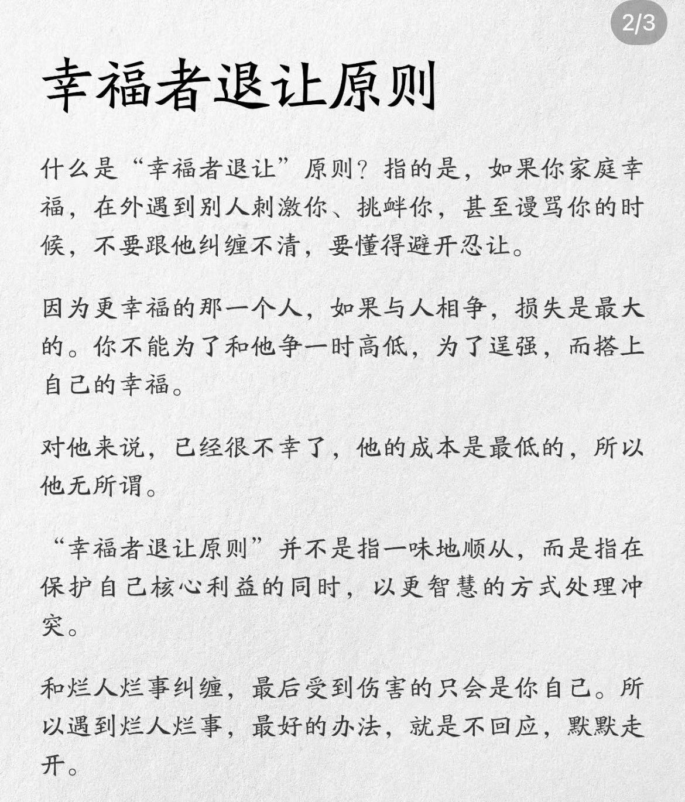

> 最近的新闻充满了戾气，让人看了感到不安，为了最大保护自己的利益，有人总结了幸福者退让原则...

什么是 " 幸福者退让 " 原则？这个原则的核心含义是：

1. 当你生活幸福时，如果遇到他人的刺激、挑衅，甚至是侮辱，不要与对方纠缠不清，而应该懂得避开和忍让。
2. 对于更幸福的人来说，与人相争是最大的损失。不要为了一时的意气之争或为了证明自己更强，而失去了自己的幸福。
3. 从对方的角度来看，他们可能已经很不幸福了，所作所为的成本是最低的，因此无所顾忌。
4. " 幸福者退让原则 " 并非简单地示弱或盲目顺从，而是在保护自己核心利益的同时，用更智慧的方式来处理冲突。
5. 与不讲理的人纠缠，最终受伤的只会是自己。因此，遇到这样的人和事，最好的应对方式就是不回应，默默走开。

这个原则的精髓在于提醒我们：真正的智慧不在于争强好胜，而在于懂得保护自己的幸福。

> 这个原则来源于推特，当时看到觉得很有道理就保存图片了，暂时没有找到原始作者，如果后续发现，会修正。
