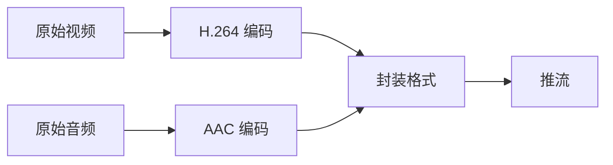
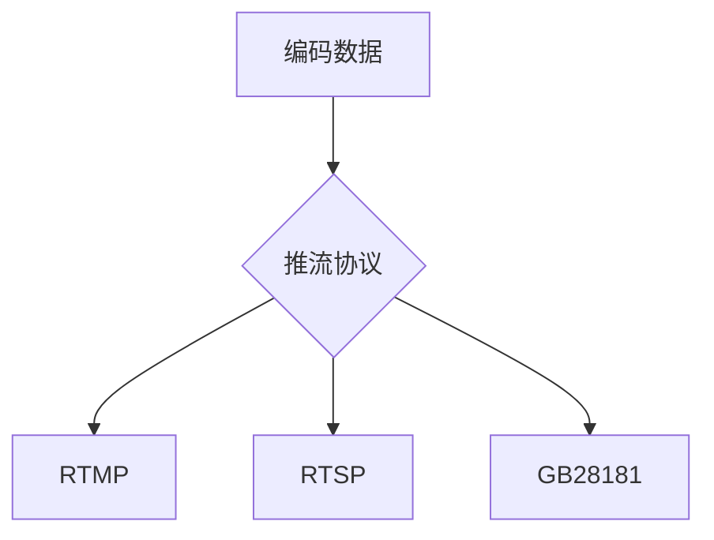
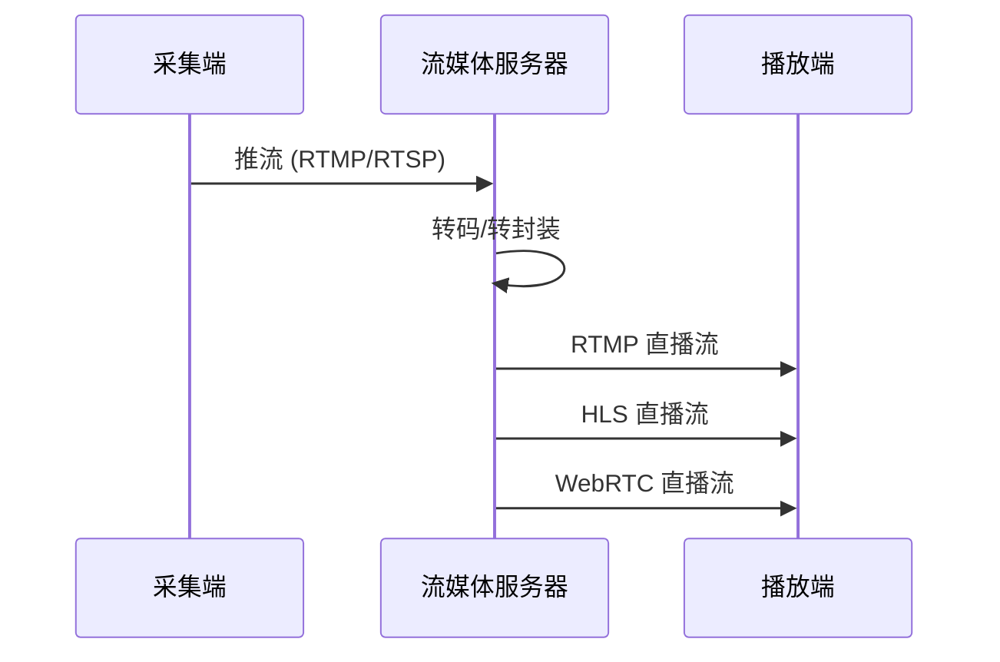
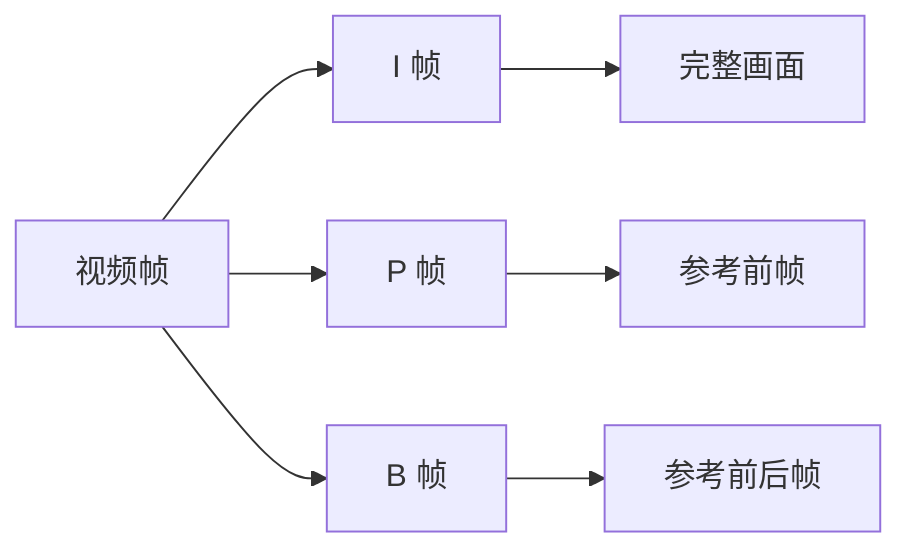
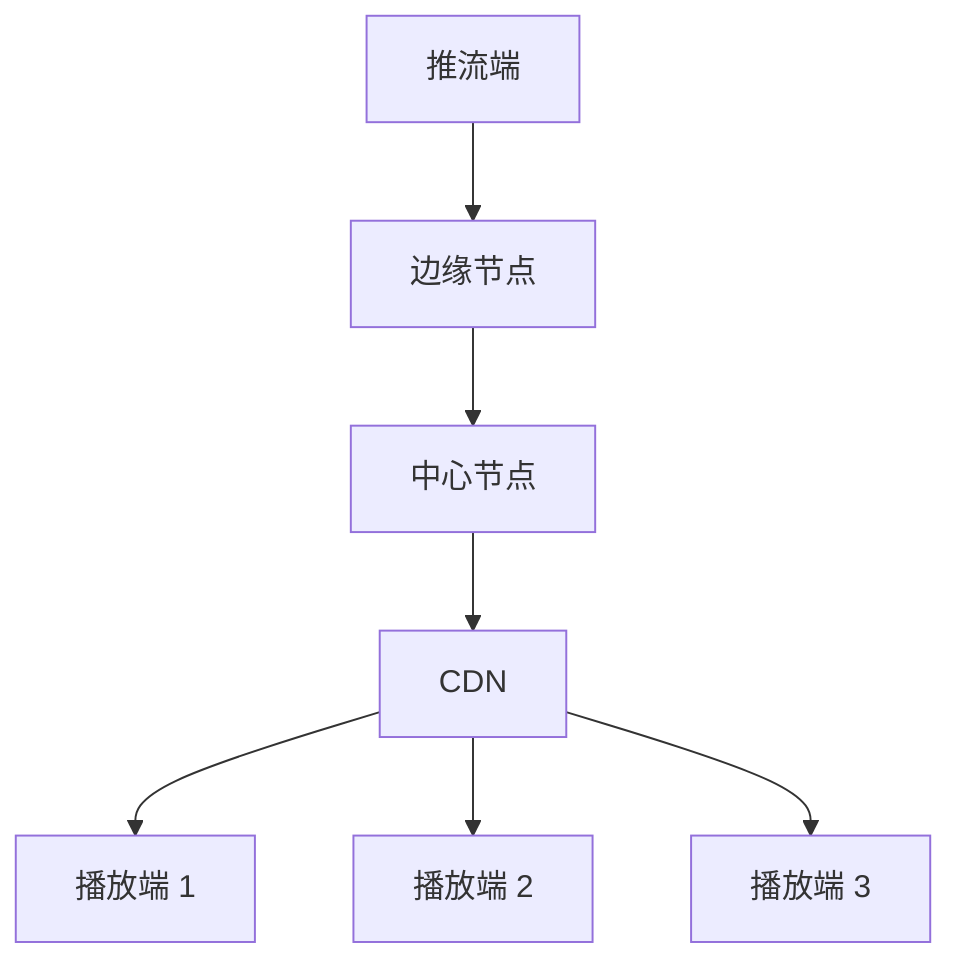

> 公司有业务要使用大疆无人机，其中需要直播推流，顺便了解下直播的原理...

**基本流程**


**详细步骤**

**1. 采集**

• 视频采集：摄像头捕获图像

• 音频采集：麦克风采集声音

视频: YUV/RGB 格式的原始数据

音频: PCM 格式的原始数据

**2. 编码**

• 视频编码：H.264/H.265/AV1

• 音频编码：AAC/MP3



**3. 推流协议**

• RTMP (Real-Time Messaging Protocol)

• RTSP (Real Time Streaming Protocol)

• GB28181 (国标协议)



**4. 流媒体服务器处理流程**



**5. 播放协议延迟对比**

| 协议 | 延迟 | 优点 | 缺点 | 适用场景 |
|------|------|------|------|----------|
| WebRTC | <1s | 超低延迟，支持 P2P | 架构复杂，成本高 | 视频会议，实时互动 |
| RTMP | 2-3s | 延迟较低，技术成熟 | 需要 Flash 支持 | 直播推流，游戏直播 |
| HLS | >10s | 兼容性好，稳定性高 | 延迟大 | 点播，大规模直播 |

**关键技术点**

**1. 编码原理**



**2. 直播架构**



**实际应用配置**

**Nginx-RTMP 配置示例**

```nginx
rtmp {
    server {
        listen 1935;
        application live {
            live on;
            hls on;
            hls_path /tmp/hls;
        }
    }
}
```

**带宽计算**

比特率 = 分辨率 × 帧率 × 压缩比

1080p@30fps ≈ 2-4 Mbps
